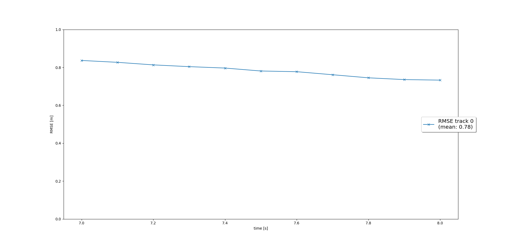

# Udacity-Sensor_Fusion-Final_Project
This is my project for Udacity Self Driving Cars Nano Degree Second Module Sensor fusion Final Project
Check above folders for images of results
# Recap, Results and Technical problems faced during project
## EKF
At first I started to follow lessons steps to implement EKF using the same equations but with small changes for system matrix F, process noise covariance Q and measurement matrix H to have finally a result but not satisfied one as the RMSE was higher than 0.35 and with some adjustments in parameters it still higher to finally realize the I am using the wrong results file and replace it to have the required RMSE = 0.32
the output with old results

the output with old results after some tuning

the output with correct results

## Trackmanagment
As following lesson steps I found a non-satisfing results as it used Delete if score smaller than 0.17 but as I decrease this to 0.1 I had the required output with over all high RMSE of 0.78 but it was fine for this task

## Data Association
Now it's the time to associate track with measurments by using mahalanobis distance as it was clarifed in lessons to match nearest pairs to have a finally good results within the required range

## Camera-Lidar Sensor Fusion
2 different sensors needed to fuse thier results together with sensor fusion at first it was confusing but as i started and used homogeneous transformation matrix to transform both to vehicle coordinate and about how to activate the camera with lidar i tried many things but it finally with simply remove if statment line of sensor.name == lidar to have both sensors activated
to have final results as shown in attached folder to this repositery with video and some images
but also have RMSE graph

it wasn't normal to me to have a smaller RMSE than having lidar only but I found that it have higher overall accuracy

# Most Difficult Part?
for me as still fresh gradute is to work with a huge code and having some specific tasks to finish that need to go in harmoney with the whole code 
so it is needed to full understand how the whole process run to keep on track but it still a great experience

# Do you see any benefits in camera-lidar fusion compared to lidar-only tracking (in theory and in your concrete results)?
Yes, it wasn't normal to me to have a smaller RMSE than having lidar only but I found that it have higher overall accuracy
so I found more sensors will give higher accuracy and RMSE can be improved with better tunning

Which challenges will a sensor fusion system face in real-life scenarios? Did you see any of these challenges in the project?
Every sensor have it's weak point like camera in night and lidar for it's price and size and also in rains
and I belive that camera results are worst than that of lidar so as both fused I had lower RMSE so may be adding sensor give worst results if it's not well deployed but every sensor has it's challanges to solve to finally having best system
# Can you think of ways to improve your tracking results in the future?
Improve some results output later to have better outputs
but over all the results still acceptable
